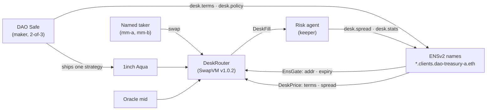

<p align="center">
  
</p>

<h1 align="center">watermark</h1>

<p align="center">
  <strong>Your treasury, now a market maker.</strong><br />
  One Safe signature opens the desk. Named takers do the rest.
</p>

<p align="center">
  🏆 <strong>ETHGlobal Tokyo 2026 · Finalist</strong><br />
  🥉 <strong>ETHGlobal Tokyo 2026 Partner Track · 1inch Build an Aqua App · 3rd place</strong>
</p>

<p align="center">
  Built on <a href="https://github.com/1inch/aqua">1inch Aqua</a> and <a href="https://ens.domains/ensv2">ENSv2</a> · Sepolia testnet · not audited
</p>

---

## The problem

A DAO sells treasury assets through a multisig. Selling in slices means a proposal, signatures and a fresh price for every slice, so the whole amount usually goes out at once: into a pool that charges slippage on size, or to a solver whose price already holds its cut.

## What watermark does

watermark turns the DAO's Safe into its own OTC desk.

- **Quote, don't dump.** The Safe signs once and ships one SwapVM strategy to 1inch Aqua. The DAO posts its own price on the oracle mid, takers fill it in small pieces over time, and tokens leave the Safe only at the moment of each fill.
- **Only named takers.** Every counterparty is an ENS name under the desk, like `mm-a.clients.dao-treasury-a.eth`. At every fill the router reads that name. It must point to the wallet that is trading, it must not have expired, and it must carry the DAO's terms. Any other wallet is refused on chain before a token moves.
- **Spreads that follow behavior.** The DAO writes its policy once, in plain English, and sets the widest spread any taker can get. After each fill a risk agent looks at how that taker traded (how big, how often, and whether the price jumped their way right after) and writes that taker's next spread to its ENS name. It never goes past the limit and needs no new Safe signature. Takers who trade fair get up to 3× tighter spreads. Takers who trade sharp stay at the edge.

## How it works



The router is a copy of the SwapVM v1.0.2 Aqua router with its opcode table cut down (no fees, no AMM curves) and two instructions added. The contracts store no configuration. Everything they read at fill time lives in ENS.

| Piece | What it does |
| --- | --- |
| **EnsGate** (opcode 34) | The taker must be the `addr` of a name under `clients.dao-treasury-a.eth` that has not expired and uses the desk's resolver. Otherwise the fill reverts. |
| **DeskPrice** (opcode 35) | Prices from the oracle mid: `ask = mid × (1 + sell)`, `bid = mid × (1 − buy)`. The widths come from that name's live `desk.spread`, or else its `desk.terms`. The oracle must be fresh (600 s), one fill is capped by the name's terms, and the desk stops selling ETH once ETH is 70% of the book. |
| **Risk agent** | A keeper watches `DeskFill`, reads `desk.policy`, picks the filler's next tier and writes `desk.spread` and `desk.stats` on that name. The Safe grants it those two records only: it cannot touch terms, addresses, caps, expiry or the oracle. |
| **Web app** | Treasury view (Dashboard, Open a desk, Counterparties, Risk agent, Fills, Controls), taker view (Trade, My fills), and Verify a fill, which recomputes any fill's price from chain data. |

### The demo desk

| Setting | Value |
| --- | --- |
| Desk name | `dao-treasury-a.eth` |
| Counterparties | `mm-a.clients.dao-treasury-a.eth`, `mm-b.clients.dao-treasury-a.eth` |
| Terms (widest spread) | sell 3 bp, buy 10 bp |
| Agent tiers (sell / buy) | tight 1 / 4 bp, standard 2 / 8 bp, limit 3 / 10 bp |
| Cap per fill | 50 ETH |
| ETH target | 70% of the book |
| Oracle freshness | 600 s (50 blocks) |

## Live on Sepolia

| Contract | Address |
| --- | --- |
| Treasury Safe (2-of-3) | [`0x213C5832c77F8e27b544881325f9E68C0434027a`](https://sepolia.etherscan.io/address/0x213C5832c77F8e27b544881325f9E68C0434027a) |
| DeskRouter | [`0xD6e721C463aa4cE0390f828da424530883975428`](https://sepolia.etherscan.io/address/0xD6e721C463aa4cE0390f828da424530883975428) |
| 1inch Aqua | [`0x1111113ccf1426a8e30e2bff5e005d929bf6a90a`](https://sepolia.etherscan.io/address/0x1111113ccf1426a8e30e2bff5e005d929bf6a90a) |
| Oracle (demo) | [`0xbD625C653F6f703a4040d892882d3Ed254947404`](https://sepolia.etherscan.io/address/0xbD625C653F6f703a4040d892882d3Ed254947404) |
| ENS resolver | [`0x228bd144dB976960E8D5AbfAe6d5CeB15346970F`](https://sepolia.etherscan.io/address/0x228bd144dB976960E8D5AbfAe6d5CeB15346970F) |
| Risk agent (`risk.agents.dao-treasury-a.eth`) | [`0xcCf3e2aD56Af881C13CCEb19Ab6cEbFbDD739899`](https://sepolia.etherscan.io/address/0xcCf3e2aD56Af881C13CCEb19Ab6cEbFbDD739899) |

Every address and desk parameter is in [`config/sepolia.json`](config/sepolia.json). The ENS side (registries, names, the Safe handoff) is in [`ens/README.md`](ens/README.md).

## Repository

| Path | What's there |
| --- | --- |
| [`contracts/`](contracts) | Foundry. `DeskRouter`, `EnsGate`, `DeskPrice`, the deploy and oracle scripts, and tests including a Sepolia ENS fork test. SwapVM v1.0.2 is the submodule in `contracts/lib/swap-vm`. |
| [`ts/`](ts) | `@desk/lib`: encoders, the price mirror, the browser client, Safe setup, `ship`, the keeper and risk agent, the market-maker bot, demo scenes and e2e. |
| [`web/`](web) | The watermark web app: Vite, React, Astryx, wagmi and viem. Deployed on Vercel. |
| [`api/`](api) | Read API and Sepolia indexer on SQLite. Deployed on Render. |
| [`ens/`](ens) | ENS lane: resolver, subregistries, names, records and the Safe handoff. |
| [`docs/`](docs) | [Agent design](docs/agent-design.md), [decision log](docs/decision-log.md), [diagrams](docs/diagrams), the [design system](docs/design) and the build rules. |
| [`requirements/`](requirements) | One requirement per pull request. |

Inside the code the project is still called Desk (`DeskRouter`, `@desk/lib`, the `desk.*` ENS records). watermark is the product name.

## Run it

Needs Foundry, Node 24, pnpm 11 and yarn 1.22. CI's exact versions are in [`.github/workflows/qc.yml`](.github/workflows/qc.yml).

```bash
git submodule update --init
(cd contracts/lib/swap-vm && yarn install --frozen-lockfile)
pnpm install
```

### Web app

```bash
cp web/.env.example web/.env.local   # VITE_DESK_MODE=live reads Sepolia; fixture uses seeded data
pnpm -C web dev --host 127.0.0.1 --port 5173
```

See [`web/README.md`](web/README.md) for the build, the preview and the licensed font.

### QC gate

```bash
make check
```

`make check` runs, in order: `forge fmt --check`, `forge build --sizes`, `forge test`, `pnpm -C ts lint`, `pnpm -C ts typecheck`, `pnpm -C ts test --passWithNoTests`, `pnpm secretlint "**/*"`. CI runs it on every pull request.

### Deploy and demo (Sepolia)

Copy `.env.example` to `.env` on the one machine that sends transactions. Then:

```bash
(cd contracts && forge script script/Deploy.s.sol --rpc-url $SEPOLIA_RPC_URL --broadcast --verify)
pnpm safe:setup --mint
pnpm ship
pnpm -C ts keeper          # the risk agent: writes each filler's next spread
pnpm -C ts demo <scene>    # setup, trade, target, stale, second-ship or restore
```

The ENS names and records must exist before `ship`. See [`ens/README.md`](ens/README.md).

## Team

Born at ETHGlobal Tokyo 2026. Built by **hyeon-Sec**, **sdh2222** and **3DUCK** with [@BlockchainatYU](https://x.com/BlockchainatYU).

Thank you to the 1inch and ENS teams for the ground this stands on.

## Credits

Powered by SwapVM. Copyright © 2025 Degensoft Ltd. SwapVM v1.0.2 is used under `LicenseRef-Degensoft-SwapVM-1.1`; the modified files are listed in [`NOTICE.md`](NOTICE.md). Built on 1inch Aqua and ENSv2. This project is not affiliated with or endorsed by Degensoft, 1inch or ENS.

## How we build

This repository is separate from [sdh2222/ethtokyo](https://github.com/sdh2222/ethtokyo), which stays the briefing workspace. Product changes land here, one requirement per pull request.

1. A member opens a pull request whose only new file is one requirement under `requirements/`.
2. One cloud agent claims that PR. If the requirement is unclear, the agent asks the missing questions and stops. If it is clear, the agent implements that requirement only and pushes onto the same branch.
3. The main agent, or the member who opened the PR, reviews code quality and runs QA.
4. Pass merges. A failed implementation goes back to the agent with the defects. A failed requirement is rewritten and starts again at the clarity check.

An agent that implements a fuzzy requirement guesses, and the review then argues about the guess. Stopping before any product code is the fast path. A clear requirement is one behavior, with acceptance checks someone can run.

The state machine is in [docs/loop.md](docs/loop.md), the reviewer checklist in [docs/review.md](docs/review.md) and the implementer rules in [AGENTS.md](AGENTS.md).

| Label | Meaning |
| --- | --- |
| `requirement` | Intake. One requirement, no product code yet. |
| `needs-clarification` | Agent stopped. Waiting on the author. |
| `implementing` | Claimed and clear. Agent is writing the one change. |
| `in-review` | Implementation is pushed. Waiting on QA. |
| `re-requirement` | The requirement itself changed. Clarity check runs again. |
