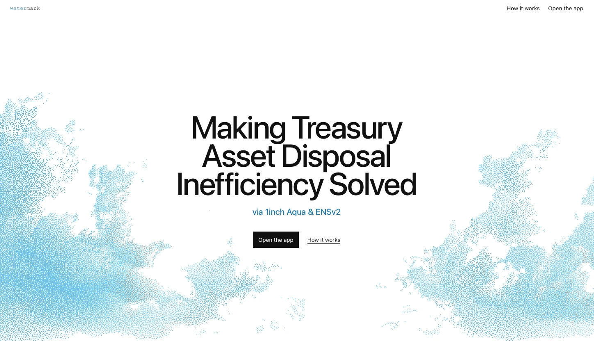
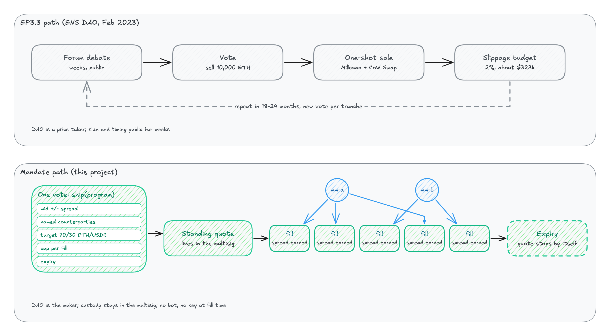
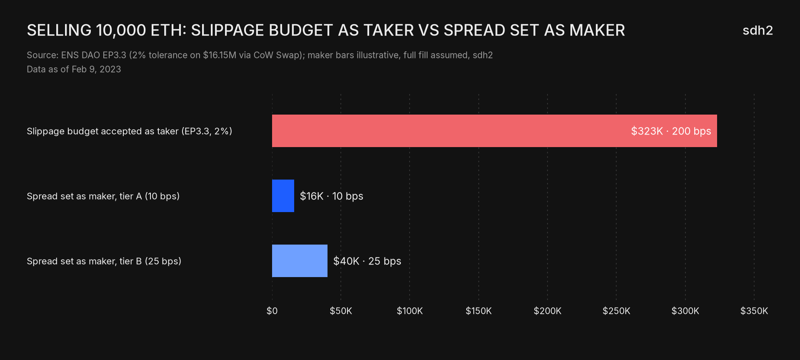
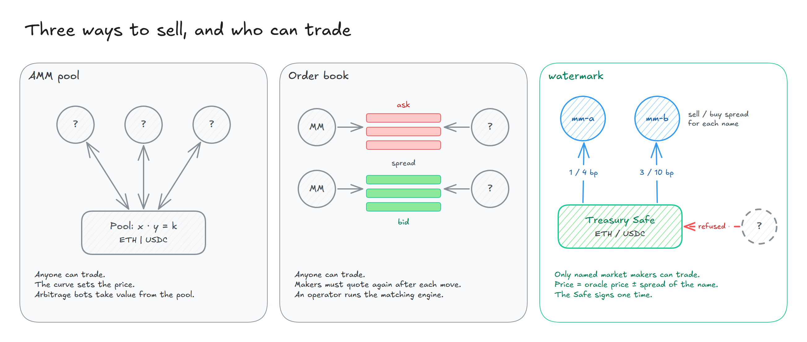
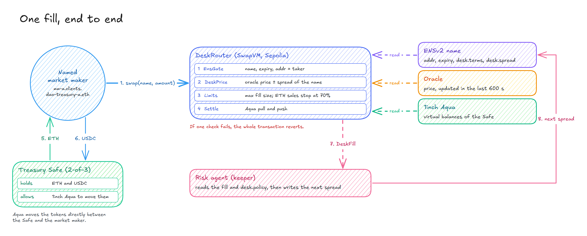
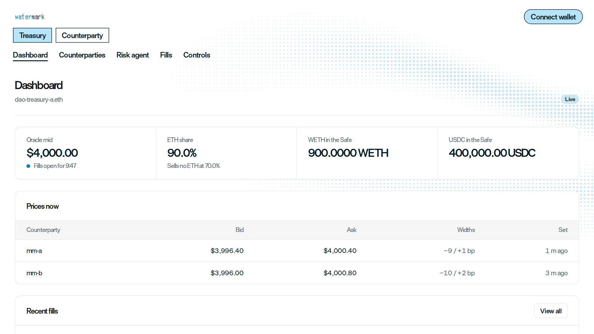
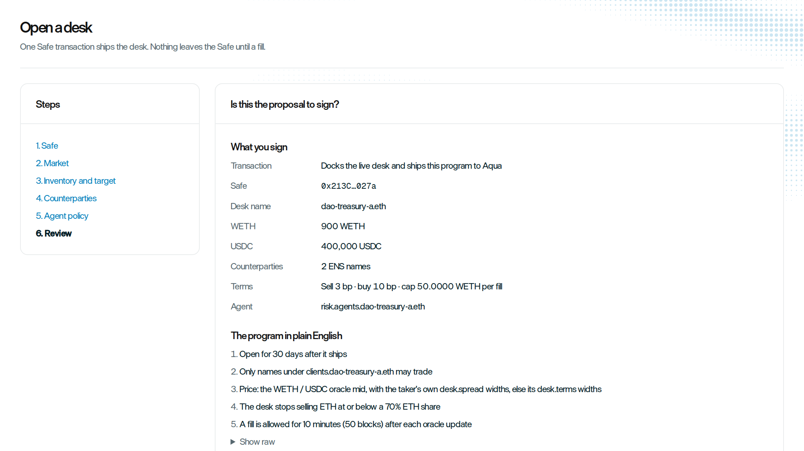
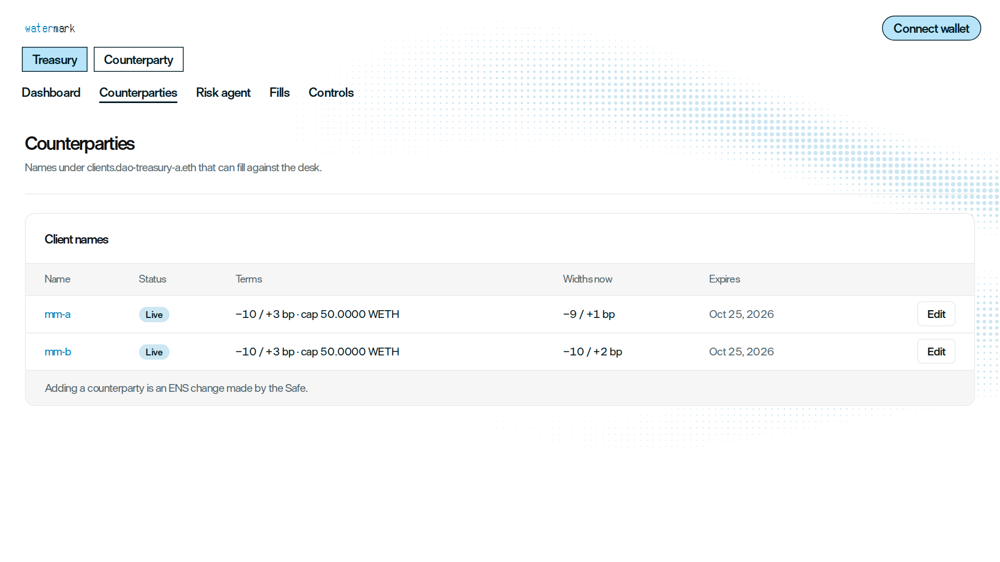
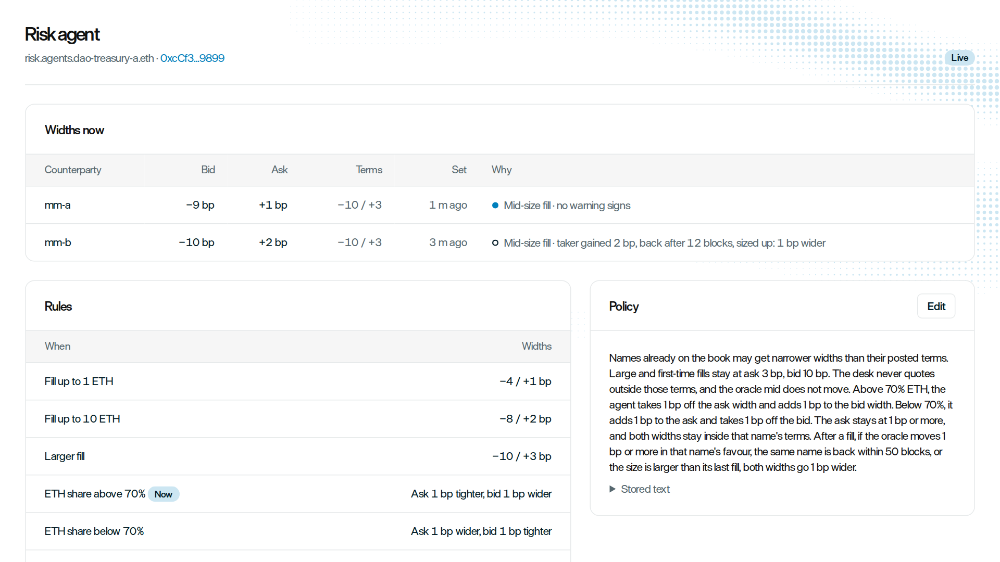
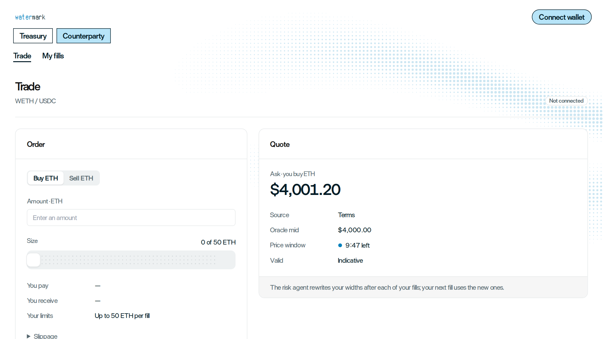

<p align="center">
  
</p>

<h1 align="center">watermark</h1>

<p align="center">
  <strong>A DAO treasury loses money to the spread each time it sells. With watermark, the treasury earns the spread.</strong>
</p>

<p align="center">
  🏆 <strong>ETHGlobal Tokyo 2026 · Finalist</strong><br />
  🥉 <strong>ETHGlobal Tokyo 2026 Partner Track · 1inch Build an Aqua App · 3rd place</strong>
</p>

<p align="center">
  Built on <a href="https://github.com/1inch/aqua">1inch Aqua</a> and <a href="https://ens.domains/ensv2">ENSv2</a> · Sepolia testnet · not audited
</p>

---

watermark is a tool for DAO treasuries that sell their assets. The treasury does not sell into the market as a taker. It quotes its own prices to market makers that it names. watermark uses 1inch Aqua and ENSv2.

## The problem

A DAO treasury usually sells its assets as a taker. It sells into a pool and pays slippage for the size of the sale. Or it sells to a solver, and the price of the solver includes a fee. In both cases, the treasury pays the spread to a different party.

The treasury can sell in small parts over a long time. But each part needs a proposal, multisig signatures, and a new price. Thus most treasuries sell the full amount in one trade.

Example: In February 2023, ENS DAO voted to sell 10,000 ETH (approximately $16M) for 18 to 24 months of operations ([EP3.3](https://docs.ens.domains/dao/proposals/3.3)). Some delegates wanted to sell in small parts. Each part needed a separate vote. Thus the DAO sold all of the ETH in one trade through CoW Swap, with a slippage limit of 2% (approximately $323k). The size and the time of the sale were public for weeks.

<p align="center">
  
</p>

<p align="center">
  
  <br /><sub>The maker values are examples. They assume that the market makers buy all of the ETH.</sub>
</p>

## What watermark does

watermark changes the role of the treasury from taker to maker.

<p align="center">
  
</p>

### The treasury quotes its own prices

- The Safe signs one time. It sends one SwapVM strategy to 1inch Aqua.
- The strategy quotes a sell price and a buy price near the oracle price.
- Market makers fill the quote in small parts over time.
- The treasury earns the spread on each fill.
- The tokens stay in the Safe until each fill.

In the demo, a sale fills 3 bp above the oracle price. A sale into the market with a 2% slippage limit can lose up to 2%.

### Only named market makers can fill

An open quote is a risk. When the market price moves, a fast bot can fill the old price before the treasury changes it. Thus each market maker gets an ENS name under the name of the treasury, for example `mm-a.clients.dao-treasury-a.eth`.

At each fill, the router reads this name. The fill occurs only if all of these conditions are true:

- The name points to the wallet that trades.
- The name is not expired.
- The name has the terms of the treasury.

If one condition is false, the router stops the fill before tokens move.

### The spread changes with the behavior of each market maker

The treasury writes its policy one time, in plain English. The policy sets the maximum spread for each market maker. After each fill, a risk agent examines how the market maker traded:

- the size of the trade
- the number of trades in a short time
- the movement of the price after the trade

Then the agent writes the next spread for that market maker to its ENS name. The spread always stays in the limits of the policy. The Safe does not sign again.

A market maker that trades fairly can get a spread that is up to 3 times smaller. A market maker that often trades just before the price moves in its favor stays at the maximum spread.

## Terms

| Term | Meaning | Name in the code |
| --- | --- | --- |
| **Treasury** | The Safe multisig of the DAO. The treasury holds the assets and sets the prices. The treasury is the maker. | `safe` |
| **Desk** | The open offer of one treasury to trade. A desk has two parts. The first part is the strategy that the Safe sends one time to 1inch Aqua. The second part is the rules in the ENS names of the treasury. In the web app, "Open a desk" makes a desk. | `DeskRouter`, `@desk/lib`, `desk.*` records |
| **Named market maker** | A company that the treasury permits to fill its quote. Each named market maker has an ENS name under the treasury, for example `mm-a.clients.dao-treasury-a.eth`. The contracts use the word "taker". | `taker`, `mms` |
| **Terms** | The maximum spread and the maximum fill size for one market maker. Only the Safe can change the terms. | `desk.terms` |
| **Spread** | For one market maker, the distance of the treasury prices from the oracle price. The sell price is above the oracle price. The buy price is below it. The risk agent sets the spread in the limits of the terms. If no spread is set, the terms apply. | `desk.spread` |
| **Policy** | The rules of the treasury for the risk agent, in plain English. | `desk.policy` |
| **Fill** | One trade by a named market maker at the price of the treasury. | `DeskFill` event |

## How it works

<p align="center">
  
</p>

The router is a copy of the SwapVM v1.0.2 Aqua router. We removed the fee and AMM instructions, and we added two instructions. The contracts keep no configuration. At each fill, the router reads all of its settings from ENS. For the details, see [DeskRouter and the opcodes](#deskrouter-and-the-opcodes).

| Part | Function |
| --- | --- |
| **EnsGate** (opcode 34) | Makes sure that the taker is the `addr` of a name under `clients.dao-treasury-a.eth`. The name must not be expired. The name must use the ENS resolver of the treasury. If a check fails, the fill reverts. |
| **DeskPrice** (opcode 35) | Calculates the price from the oracle price: `ask = mid × (1 + sell)`, `bid = mid × (1 − buy)`. It uses the live `desk.spread` of the name. If there is no live spread, it uses the `desk.terms` of the name. The oracle price must be less than 600 seconds old. The terms of the name set the maximum fill size. When ETH is 70% of the holdings by value, the treasury stops sales of ETH. |
| **Risk agent** | A keeper reads each `DeskFill` event and the `desk.policy` record. It selects the next tier for the market maker. Then it writes `desk.spread` and `desk.stats` on the name of the market maker. The Safe gives the agent permission for these two records only. The agent cannot change the terms, the addresses, the caps, the expiry, or the oracle. |
| **Web app** | Pages for the treasury: Dashboard, Open a desk, Counterparties, Risk agent, Fills, Controls. Pages for market makers: Trade, My fills. The "Verify a fill" page calculates the price of a fill again from on-chain data. |

### Example

The oracle price is $4,000. The terms of both names are sell 3 bp and buy 10 bp. After the last fills, the risk agent set these spreads:

| Market maker | Spread now (sell / buy) | Ask: the market maker buys ETH | Bid: the market maker sells ETH |
| --- | --- | --- | --- |
| mm-a | 1 / 9 bp | $4,000.40 | $3,996.40 |
| mm-b | 2 / 10 bp | $4,000.80 | $3,996.00 |
| Terms (maximum) | 3 / 10 bp | $4,001.20 | $3,996.00 |

mm-b has a wider spread than mm-a. After its last fill, the price moved 2 bp in its favor, and it came back after 12 blocks with a larger size.

mm-a buys 10 ETH at $4,000.40 and pays 40,004 USDC. The treasury gets $4 more than the oracle value of the ETH. A sale of the same 10 ETH into the market with a 2% slippage limit can lose up to $800.

### The demo setup

| Setting | Value |
| --- | --- |
| Treasury ENS name | `dao-treasury-a.eth` |
| Named market makers | `mm-a.clients.dao-treasury-a.eth`, `mm-b.clients.dao-treasury-a.eth` |
| Terms (maximum spread) | sell 3 bp, buy 10 bp |
| Agent tiers (sell / buy) | tight 1 / 4 bp, standard 2 / 8 bp, limit 3 / 10 bp |
| Maximum fill size | 50 ETH |
| Sales of ETH stop at | 70% of the holdings by value |
| Maximum age of the oracle price | 600 s (50 blocks) |

## The life of a desk

| Stage | What occurs | Who signs |
| --- | --- | --- |
| Open | "Open a desk" in the web app shows the transaction and the program in plain English. The Safe approves 1inch Aqua for WETH and USDC, and ships the program. The tokens stay in the Safe. | The Safe, one transaction |
| Set the rules | Each named market maker gets an ENS name. The Safe writes `desk.terms` on each name and `desk.policy` on the treasury name. | The Safe |
| Trade | Named market makers fill the quote. After each fill, the risk agent writes the next spread of that market maker. | Each market maker signs its own fill. The Safe does not sign. |
| Change | The Safe can change the terms of a name, the policy, or the list of names. The program does not change, so the desk stays open. To stop one market maker, the Safe sets its maximum fill size to 0, or the name expires. | The Safe |
| Close | The program stops at its deadline (30 days in the demo). The Safe can also dock the program in Aqua at any time. | The Safe, or no one at the deadline |

The ETH target (70%) and the maximum oracle age (50 blocks) are arguments in the program. To change them, the Safe docks the program and ships a new program.

## The app

The web app has pages for the treasury and pages for market makers. In live mode, each page reads its data from Sepolia.

<table>
  <tr>
    <td width="50%"></td>
    <td width="50%"></td>
  </tr>
  <tr>
    <td><b>Dashboard.</b> The oracle price, the ETH share, the Safe balances, and the prices for each market maker now.</td>
    <td><b>Open a desk.</b> The transaction that the Safe signs, and the program in plain English.</td>
  </tr>
  <tr>
    <td width="50%"></td>
    <td width="50%"></td>
  </tr>
  <tr>
    <td><b>Counterparties.</b> The named market makers, their terms, their spreads now, and their expiry dates.</td>
    <td><b>Risk agent.</b> The spread of each market maker and the reason for it, the rules, and the policy in plain English.</td>
  </tr>
  <tr>
    <td width="50%"></td>
    <td width="50%"></td>
  </tr>
  <tr>
    <td><b>Trade</b> (market makers). The quote, the time left in the price window, and the fill limit.</td>
    <td></td>
  </tr>
</table>

## DeskRouter and the opcodes

### What we changed in SwapVM

SwapVM is the 1inch virtual machine for swaps. A maker ships a program to 1inch Aqua. At each swap, the router runs the instructions of the program in sequence. Each instruction has an opcode number.

`DeskRouter` is the SwapVM v1.0.2 `AquaSwapVMRouter` with a new opcode table, `DeskOpcodes`. The table comes from the SwapVM `AquaOpcodes` table. Tokens move through Aqua as in the original router.

| Opcode | Instruction | In DeskRouter |
| --- | --- | --- |
| 10 to 12 | `_jump`, `_jumpIfTokenIn`, `_jumpIfTokenOut` | Kept from SwapVM |
| 13 | `_deadline` | Kept. The watermark program uses it. |
| 14 to 16 | Balance and supply checks on the taker token | Kept from SwapVM |
| 20 | `_salt` | Kept. The watermark program uses it. |
| 33 | `_onlyTxOriginTokenBalanceNonZero` | Kept. The watermark program does not use it, so a contract wallet can fill. |
| **34** | **`EnsGate`** | **New** |
| **35** | **`DeskPrice`** | **New** |
| All other opcodes | Fee and AMM instructions | Removed. They do nothing in DeskRouter. |

### The program that the Safe ships

The Safe ships one program with four instructions, in this sequence:

1. `_deadline` (13): the program stops at a deadline. The demo uses 30 days.
2. `_salt` (20): makes each program unique.
3. `EnsGate` (34): arguments are the ENS registry, the desk registry, the clients registry, the resolver, and the name suffix.
4. `DeskPrice` (35): arguments are the resolver, the oracle, WETH, USDC, the decimals, the maximum oracle age in blocks (50), and the ETH target (7000 bp).

The taker sends its ENS name, DNS-encoded, in the taker data of the swap.

### EnsGate (opcode 34)

EnsGate does these checks in this sequence. If a check fails, the transaction reverts with the error in the table.

| Step | Check | Error |
| --- | --- | --- |
| 1 | The taker data has an ENS name. | `EnsGateMissingName` |
| 2 | The name ends with `clients.dao-treasury-a.eth`. | `EnsGateNameNotUnderDesk` |
| 3 | The desk registry and the clients registry on chain are the registries in the program. | `EnsGateDeskMismatch`, `EnsGateClientsMismatch` |
| 4 | The name is not expired. | `EnsGateNameExpired` |
| 5 | The name uses the resolver of the treasury. | `EnsGateWrongResolver` |
| 6 | The `addr` of the name is the taker of the swap. | `EnsGateTakerMismatch` |

### DeskPrice (opcode 35)

DeskPrice calculates the price and the amounts in this sequence:

1. It makes sure that the pair is WETH and USDC (`DeskPriceUnsupportedPair`).
2. It reads the oracle price. The price must be less than 50 blocks (600 s) old (`DeskPriceOracleStale`).
3. It reads the `desk.terms` record of the name: version, sell bp, buy bp, and the maximum fill size (`DeskPriceNoTerms`).
4. It reads the `desk.spread` record of the name. It uses this spread only if the spread is live: version 1, the sell width is less than the buy width, both widths are in the terms, and the time limit is in the future. If the spread is not live, it uses the terms.
5. It calculates the ETH share of the Safe balances at the oracle price. If the taker buys ETH and the share is 70% or less, the fill reverts (`DeskPriceTargetReached`).
6. It calculates `ask = price × (1 + sell)` and `bid = price × (1 − buy)`, and then the amounts. The amounts round in favor of the treasury.
7. It makes sure that the ETH amount is not more than the maximum fill size (`DeskPriceCapExceeded`) and that the Safe has sufficient tokens (`DeskPriceInsufficientInventory`).
8. On a real fill, it emits `DeskFill`. The event has the name, the amounts, the oracle price, the spread, and the ETH share before the fill. The risk agent reads this event.

A quote is a static call to the same router. Thus the quote in the web app and the fill use the same code.

The tests are in [`contracts/test/`](contracts/test): `EnsGate.t.sol`, `DeskPrice.t.sol`, `OpcodeTable.t.sol`, `DeskRouter.integration.t.sol`, and a fork test on Sepolia ENS.

## Live on Sepolia

| Contract | Address |
| --- | --- |
| Treasury Safe (2-of-3) | [`0x213C5832c77F8e27b544881325f9E68C0434027a`](https://sepolia.etherscan.io/address/0x213C5832c77F8e27b544881325f9E68C0434027a) |
| DeskRouter | [`0xD6e721C463aa4cE0390f828da424530883975428`](https://sepolia.etherscan.io/address/0xD6e721C463aa4cE0390f828da424530883975428) |
| 1inch Aqua | [`0x1111113ccf1426a8e30e2bff5e005d929bf6a90a`](https://sepolia.etherscan.io/address/0x1111113ccf1426a8e30e2bff5e005d929bf6a90a) |
| Oracle (demo) | [`0xbD625C653F6f703a4040d892882d3Ed254947404`](https://sepolia.etherscan.io/address/0xbD625C653F6f703a4040d892882d3Ed254947404) |
| ENS resolver | [`0x228bd144dB976960E8D5AbfAe6d5CeB15346970F`](https://sepolia.etherscan.io/address/0x228bd144dB976960E8D5AbfAe6d5CeB15346970F) |
| Risk agent (`risk.agents.dao-treasury-a.eth`) | [`0xcCf3e2aD56Af881C13CCEb19Ab6cEbFbDD739899`](https://sepolia.etherscan.io/address/0xcCf3e2aD56Af881C13CCEb19Ab6cEbFbDD739899) |

All addresses and settings are in [`config/sepolia.json`](config/sepolia.json). The ENS setup (registries, names, and the Safe handoff) is in [`ens/README.md`](ens/README.md).

## Repository

| Path | Contents |
| --- | --- |
| [`contracts/`](contracts) | Foundry project: `DeskRouter`, `EnsGate`, `DeskPrice`, the deploy and oracle scripts, and the tests. The tests include a fork test on Sepolia ENS. SwapVM v1.0.2 is a submodule in `contracts/lib/swap-vm`. |
| [`ts/`](ts) | `@desk/lib`: encoders, the price mirror, the browser client, Safe setup, `ship`, the keeper and risk agent, the market maker bot, demo scenes, and end-to-end tests. |
| [`web/`](web) | The watermark web app: Vite, React, Astryx, wagmi, and viem. Vercel hosts the web app. |
| [`api/`](api) | The read API and the Sepolia indexer, with SQLite. Render hosts the API. |
| [`ens/`](ens) | The ENS setup: resolver, subregistries, names, records, and the Safe handoff. |
| [`docs/`](docs) | [Agent design](docs/agent-design.md), [decision log](docs/decision-log.md), [diagrams](docs/diagrams), and the [design system](docs/design). |
| [`requirements/`](requirements) | One requirement for each pull request. See [CONTRIBUTING.md](CONTRIBUTING.md). |

The code uses the old name "Desk" (`DeskRouter`, `@desk/lib`, and the `desk.*` ENS records). The [Terms](#terms) table gives the product word for each code name.

## How to run

You need Foundry, Node 24, pnpm 11, and yarn 1.22. The CI versions are in [`.github/workflows/qc.yml`](.github/workflows/qc.yml).

```bash
git submodule update --init
(cd contracts/lib/swap-vm && yarn install --frozen-lockfile)
pnpm install
```

### Web app

```bash
cp web/.env.example web/.env.local   # VITE_DESK_MODE=live reads Sepolia. fixture uses test data.
pnpm -C web dev --host 127.0.0.1 --port 5173
```

For the build, the preview, and the licensed font, see [`web/README.md`](web/README.md).

### QC gate

```bash
make check
```

`make check` runs these commands in this sequence: `forge fmt --check`, `forge build --sizes`, `forge test`, `pnpm -C ts lint`, `pnpm -C ts typecheck`, `pnpm -C ts test --passWithNoTests`, `pnpm secretlint "**/*"`. CI runs `make check` on each pull request.

### Deploy and demo (Sepolia)

Copy `.env.example` to `.env` on the one computer that sends transactions. Then run these commands:

```bash
(cd contracts && forge script script/Deploy.s.sol --rpc-url $SEPOLIA_RPC_URL --broadcast --verify)
pnpm safe:setup --mint
pnpm ship
pnpm -C ts keeper          # the risk agent: writes the next spread for each market maker
pnpm -C ts demo <scene>    # setup, trade, target, stale, second-ship, or restore
```

Make the ENS names and records before you run `ship`. See [`ens/README.md`](ens/README.md).

## Team

watermark started at ETHGlobal Tokyo 2026. The builders are **hyeon-Sec**, **sdh2222**, and **3DUCK**, with [@BlockchainatYU](https://x.com/BlockchainatYU).

We thank the 1inch and ENS teams for their work.

## Credits

Powered by SwapVM. Copyright © 2025 Degensoft Ltd. We use SwapVM v1.0.2 under `LicenseRef-Degensoft-SwapVM-1.1`. [`NOTICE.md`](NOTICE.md) lists the files that we changed. watermark uses 1inch Aqua and ENSv2. This project has no affiliation with Degensoft, 1inch, or ENS, and they do not endorse it.

## Contributing

See [CONTRIBUTING.md](CONTRIBUTING.md).
