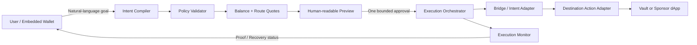

> **상태: 대체됨 — 공개(WR-12)를 위해 보관.** 행사 전 아이디어 탐색(OneIntent). 최종 제품과 무관하다.

## 1. 결론

원래 메모의 문제의식은 매우 좋다. 다만 현재는 아직 **“체인 추상화가 필요하다”는 문제 영역**이지, 심사위원에게 보여줄 수 있는 제품 아이디어는 아니다.

| 항목 | 현재 메모 | 아래처럼 좁혔을 때 |
|---|---:|---:|
| 문제의 크기 | 9/10 | 9/10 |
| 타이밍 | 9/10 | 9/10 |
| 차별성 | 4/10 | 8/10 |
| 해커톤 구현 가능성 | 3/10 | 8/10 |
| 데모 전달력 | 3/10 | 9/10 |

핵심은 새로운 브리지나 범용 solver network를 만드는 것이 아니다. 이미 있는 bridge/intent/account-abstraction 인프라를 조합해 **“사용자가 체인을 모르는 실제 dApp 행동”** 하나를 완성해야 한다.

추천하는 첫 행동은 다음과 같다.

> 사용자가 “내 USDC 100개를 이 저축 상품에 넣어줘. 총비용은 102 USDC 이하, 3분 이내로”라고 입력한다. OneIntent가 어느 체인에 자금이 있는지 찾고, swap/bridge/gas/dApp call을 하나의 제한된 intent로 만든다. 사용자는 결과와 최대 비용을 확인하고 한 번만 승인한다. 완료 후에는 브리지 토큰이 아니라 실제 예치 포지션을 받는다.

목표 dApp은 행사 스폰서와 테스트넷 상태에 따라 lending vault, prediction market deposit, subscription payment 중 하나로 교체할 수 있다. 기본안은 결과가 명확한 **USDC vault deposit**이다.

## 2. 문제 정의

사용자는 온체인에서 어떤 행동을 하기 전에 너무 많은 구현 세부사항을 알아야 한다.

- 내 자산이 어느 체인에 있는가?
- 목적 dApp은 어느 체인에 있는가?
- 어떤 토큰과 gas token이 필요한가?
- 어떤 bridge와 swap 경로가 안전하고 저렴한가?
- 중간 단계가 실패하면 자금은 어디에 남는가?
- 완료된 것이 bridge인지, 실제 dApp 행동까지인지 어떻게 확인하는가?

현재의 bridge aggregator는 주로 **이동 경로**를 단순화한다. OneIntent는 이동이 아니라 **최종 상태**를 상품의 단위로 삼는다.

> “Base에서 Arbitrum으로 USDC를 옮긴다”가 아니라 “저축 포지션을 만든다.”

## 3. 제품 정의

### 한 문장

OneIntent는 dApp 개발자가 `open from any chain` 경험을 붙일 수 있게 하는 SDK이며, 사용자의 자연어 목표를 **검증 가능한 bounded intent**로 컴파일하고 실행·추적한다.

### 대상 사용자

1. 체인, bridge, gas를 모르는 일반 사용자
2. 다른 체인의 사용자를 온보딩하고 싶은 dApp 개발자

### 제공 가치

- 사용자는 source chain, bridge, gas token을 직접 고르지 않는다.
- dApp은 각 체인별 deposit flow를 따로 개발하지 않는다.
- 사용자는 최대 지출, 최소 수령, 만료 시간, 허용 행동이 명시된 내용에만 서명한다.
- 성공 기준은 bridge 완료가 아니라 목적 dApp의 상태 변화다.

## 4. 대표 사용자 흐름

1. 사용자가 이메일/passkey 또는 지갑으로 로그인한다.
2. “100 USDC를 Savings Vault에 예치해줘. 최대 102 USDC까지만 써.”라고 입력한다.
3. OneIntent가 지원 체인들의 잔액을 조회하고 가능한 경로를 계산한다.
4. 화면에는 체인 세부사항 대신 다음 결과 중심 preview가 표시된다.
   - 지출 상한: 102 USDC
   - 예상 포지션: 약 100 vault shares
   - 예상 시간: 45~90초
   - 실패 시: 남은 자산은 사용자 계정으로 반환 또는 보관
5. 사용자가 한 번 승인한다.
6. agent가 승인 범위 안에서 swap → bridge → destination call을 실행하고 상태를 추적한다.
7. UI가 `Funds prepared → Cross-chain fill → Vault deposited`를 보여준다.
8. 최종 화면에서 vault position과 각 체인의 transaction proof를 확인한다.

고급 경로 정보는 펼쳐볼 수 있지만 기본 화면에서는 숨긴다. **체인 추상화는 정보를 없애는 것이 아니라 필요할 때만 드러내는 것**이어야 한다.

### 데모에서 공개할 기술적 전제

- `한 번 승인`은 **초기 wallet onboarding 이후의 action당 승인 횟수**를 뜻한다.
- MVP 사용자는 지원 체인에 counterfactual deployment가 가능한 ERC-4337/embedded smart account를 가진다.
- 일반 EOA와 기존 ERC-20을 처음 연결하면 account setup 또는 allowance용 추가 승인이 필요할 수 있다.
- `manual chain switch 0회`는 선택한 wallet/relayer가 해당 source chain의 programmatic signing과 submission을 지원할 때만 보장한다.

이 전제를 발표에서 먼저 밝히는 편이 오히려 신뢰를 준다. 데모 숫자를 부풀리기보다 **어떤 계정 조건에서 UX가 성립하는지** 정확히 말한다.

## 5. Agent가 꼭 필요한 이유

단순히 LLM이 bridge API를 호출하는 제품이면 차별성이 약하고 위험하다. 역할을 명확히 나눈다.

### Agent가 담당

- 자연어 목표에서 금액, 목적 행동, 시간, 비용 제한 추출
- 여러 체인의 잔액과 route quote를 비교해 계획 제안
- 비동기 실행 상태 감시
- quote 만료나 실행 전 실패 시 승인 범위 내에서 재계획
- 사용자에게 결과와 실패 원인을 자연어로 설명

### 결정론적 코드가 담당

- 잔액 및 quote 검증
- calldata 생성
- allowlist, spend cap, min output, deadline 검사
- 서명 검증과 nonce/replay protection
- simulation 및 transaction 전송
- 실제 목적 상태가 달성됐는지 onchain event/state로 확인

### Agent가 절대 하면 안 되는 일

- 자유 형식 calldata 생성 후 바로 서명 요청
- 사용자의 private key 보관
- 승인 범위를 넘어서는 route로 임의 변경
- 실패한 cross-chain transaction이 자동으로 원복된다고 주장

즉, **LLM은 planner이지 signer도 verifier도 아니다.**

## 6. Bounded Intent

자연어는 아래와 같은 typed object로 변환된다. 서명 화면은 이 구조에서 사람이 이해할 필드만 보여준다.

```json
{
  "intentId": "0x...",
  "owner": "0x...",
  "goal": "DEPOSIT",
  "destination": {
    "chainId": 421614,
    "target": "0xVault...",
    "selector": "deposit(uint256,address)",
    "recipient": "0xUser..."
  },
  "funding": {
    "sourceChains": [84532, 11155111],
    "allowedTokens": ["USDC"],
    "maxInput": "102000000"
  },
  "constraints": {
    "minShares": "99000000",
    "deadline": 1788000000,
    "allowedAdapters": ["ACROSS_OR_LIFI_ADAPTER"]
  },
  "recoveryAddress": "0xUser...",
  "nonce": 7
}
```

중요한 설계 포인트는 route 전체를 서명하는 대신 **결과와 권한의 경계**에 서명하는 것이다. 그래야 quote가 만료돼도 agent가 더 비싸거나 다른 목적의 행동을 하지 못하면서 더 나은 경로로 바꿀 수 있다.

## 7. 시스템 구조



### 프론트엔드

- Next.js + TypeScript
- viem/wagmi
- passkey 또는 embedded wallet
- 자연어 입력, intent preview, progress timeline, final proof

### Agent / API

- 구조화 출력(JSON schema)만 허용하는 intent compiler
- portfolio scanner: 지원 체인의 token balance 조회
- route adapters: 행사 스폰서에 따라 LI.FI Composer, Across, 1inch, CCIP 중 하나
- policy engine: LLM 출력과 실제 quote를 별도로 검증
- execution monitor: transaction receipt와 destination event 추적

### Contract

- `IntentPolicyAccount` 또는 기존 ERC-4337 smart account
  - EIP-712 signature 검증
  - nonce와 deadline 검사
  - token spend cap 검사
  - 허용 adapter/target/function selector 검사
  - 동일 owner와 salt로 지원 체인에 counterfactual address 계산
- `DestinationActionAdapter`
  - bridge로 받은 자산을 목적 dApp에 전달
  - `IntentFulfilled(intentId, outputAmount)` event 발생
- 데모용 `SavingsVault`
  - 행사 기간에 안정적인 외부 testnet vault가 없을 때만 사용

ERC-4337/paymaster는 gasless UX에 활용할 수 있다. ERC-7683은 설계 방향과 호환되지만, 해커톤 MVP에서 표준 전체나 solver marketplace를 새로 구현하지 않는다.

## 8. 실패와 복구 모델

“self-healing”을 말하려면 실패 시점을 구분해야 한다.

| 실패 시점 | 처리 |
|---|---|
| 서명 전 quote 만료 | 새 quote를 받아 preview 갱신 |
| 자금이 사용되기 전 route 실패 | 같은 intent 제한 안에서 다른 adapter로 재계획 |
| bridge fill 후 destination call 실패 | 자금을 destination의 사용자 smart account에 보관하고 recovery action 제공 |
| 지출 상한 또는 deadline 초과 | 자동 중단 |
| 최종 결과가 검증되지 않음 | 성공으로 표시하지 않고 `Needs recovery` 상태 표시 |

Cross-chain 작업은 원자적 rollback을 쉽게 보장할 수 없다. 이를 숨기지 않고 **자금이 지금 어디에 있는지, 다음 안전한 행동이 무엇인지** 보여주는 것이 제품의 신뢰 포인트다.

## 9. 해커톤 MVP 범위

### 반드시 구현(P0)

- EVM testnet 2개
- funding token 1개(USDC 또는 mock USDC)
- destination action 1개(vault deposit)
- 지원 체인의 balance 자동 탐색
- 자연어 → typed intent 변환
- 실제 route quote와 비용 preview
- bounded approval 1회
- 실제 cross-chain execution
- destination event/state를 통한 성공 검증
- 탐색기 링크가 포함된 progress UI

### 시간이 남으면(P1)

- 두 개 route provider 비교
- 실행 전 quote 실패를 의도적으로 발생시키는 replan demo
- gas sponsorship/paymaster
- React SDK 예시: `<OneIntentAction />`
- ENS 이름을 recovery/recipient identity로 사용

### 만들지 않을 것

- 자체 bridge
- 자체 유동성 네트워크
- 범용 solver marketplace
- 모든 체인과 모든 dApp 지원
- mainnet 자금
- 사용자의 제약 없이 행동하는 autonomous trading agent

## 10. 36시간 구현 순서

### 0~4시간: 가장 위험한 부분부터 검증

- 행사 스폰서와 지원 testnet 확정
- 실제 `source token → destination action` 경로가 되는지 CLI/script로 end-to-end spike
- route API가 destination calldata를 지원하지 않으면 즉시 대안 provider 또는 2-step 방식 결정

### 4~10시간: 계약과 성공 조건

- `DestinationActionAdapter`와 demo vault 작성
- `IntentFulfilled` event 정의
- Foundry unit test: max spend, deadline, nonce, target allowlist

### 10~18시간: 실행 파이프라인

- balance scanner
- quote adapter
- typed intent schema와 policy validator
- transaction submission과 status polling

### 18~26시간: 사용자 화면

- 로그인/지갑
- 자연어 입력
- 결과 중심 preview
- progress timeline과 final proof

### 26~32시간: 실패 시나리오와 안정화

- quote expiry/retry
- partial completion 상태 표시
- happy path를 반복 실행하는 seed/faucet script 준비

### 32~36시간: 제출

- 60~90초 demo video
- architecture image
- README, contract addresses, transaction links
- pitch와 sponsor qualification 문구 정리

## 11. 60초 데모 시나리오

1. **문제, 5초** — “사용자는 지금도 dApp을 쓰기 전에 체인과 bridge를 배워야 합니다.”
2. **목표 입력, 8초** — “100 USDC를 Savings에 넣어줘. 최대 102까지만.”
3. **자동 발견, 8초** — 자산이 다른 체인에 있음을 보여주되 사용자가 source chain을 선택하지 않는다.
4. **제한된 승인, 8초** — max spend, min position, deadline을 보여주고 한 번 승인한다.
5. **실행, 15초** — Prepare → Fill → Deposit timeline이 진행된다.
6. **검증, 8초** — destination vault shares와 transaction proof를 보여준다.
7. **마무리, 8초** — “OneIntent turns any-chain liquidity into an in-app action, not another bridge transaction.”

데모 중에는 architecture 설명보다 **클릭 수, 서명 수, chain switch가 사라지는 장면**을 먼저 보여준다.

## 12. 차별화 포인트

| 기존 제품 유형 | 보통의 종료 지점 | OneIntent의 차이 |
|---|---|---|
| Bridge UI | 목적 체인에 token 도착 | 목적 dApp의 상태 변화까지 검증 |
| Route aggregator | 사용자가 source/destination을 지정 | 목표와 제약만 받고 funding chain 자동 선택 |
| AI wallet chatbot | transaction 추천 또는 생성 | typed intent와 onchain policy로 권한 제한 |
| Smart wallet | 계정/가스 UX 개선 | cross-chain route와 application action까지 조율 |
| 새 interop protocol | 인프라/표준 구축 | 기존 인프라를 사용해 즉시 보이는 제품 경험 제공 |

가장 중요한 한 줄은 다음이다.

> **We do not abstract chains at the bridge layer; we abstract them at the user’s goal layer.**

## 13. 평가 지표

데모와 발표에서 아래 숫자를 직접 제시한다.

- 수동 chain 선택: 0회
- 수동 bridge 방문: 0회
- 사용자 승인: onboarding 이후 action당 1회
- 지원하는 중간 작업: balance discovery + route + bridge + dApp call
- 성공 판정: destination contract의 state/event
- 실패 시 표시: 마지막 성공 단계와 현재 자금 위치

## 14. 주요 위험과 대응

### “그냥 bridge aggregator wrapper 아닌가?”

최종 dApp action, goal schema, policy-bound replan, outcome verification을 데모에서 강조한다. 단순 token transfer로 끝내면 이 비판을 피할 수 없다.

### “AI가 없어도 되지 않나?”

정해진 한 화면만 보면 맞는 지적이다. 그래서 여러 funding 후보와 사용자 제약을 해석하고, 비동기 실패를 설명·재계획하는 장면을 보여준다. 반대로 quote 계산과 calldata 검증에 LLM을 쓰지 않는다.

### 외부 testnet/API가 불안정하다

첫 4시간 안에 end-to-end spike를 한다. 녹화용으로 성공한 transaction을 준비하되, 라이브 데모도 재현할 수 있도록 funding script와 fallback destination vault를 둔다.

### 범위가 다시 커진다

“2 chains, 1 token, 1 action, 1 happy path”를 끝내기 전에는 두 번째 dApp이나 비EVM 체인을 추가하지 않는다.

## 15. 제출용 소개문

### 한국어

OneIntent는 사용자가 체인 대신 원하는 결과를 선택하게 해주는 chainless action agent입니다. 사용자의 자연어 목표를 최대 지출, 최소 결과, 허용 대상, 만료 시간이 명시된 bounded intent로 변환합니다. 기존 cross-chain liquidity와 account abstraction 인프라를 이용해 자산이 있는 체인에서 목적 dApp까지 한 번의 승인으로 실행하고, bridge 완료가 아니라 실제 목적 상태가 달성되었는지를 온체인에서 검증합니다.

### English

OneIntent is a chainless action agent that lets users specify outcomes instead of networks. It compiles a natural-language goal into a bounded intent with explicit spend, output, target, and deadline constraints. Using existing cross-chain liquidity and account-abstraction rails, it funds and completes an application action from wherever the user's assets live—then verifies the destination outcome onchain, rather than stopping at a bridge transfer.

## 16. 기술 참고

- [ERC-7683: Cross Chain Intents](https://ercs.ethereum.org/ERCS/erc-7683)
- [ERC-4337 Documentation](https://docs.erc4337.io/)
- [EIP-7702: Set Code for EOAs](https://eips.ethereum.org/EIPS/eip-7702)
- [Across: Crosschain Intents](https://docs.across.to/guides/concepts/crosschain-intents)
- [LI.FI Intent / Solver Marketplace](https://docs.li.fi/lifi-intents/introduction)

## 17. 다음 결정 3개

개발 전에 아래 세 가지만 확정하면 된다.

1. 참가하는 정확한 ETHGlobal 행사와 sponsor prize 목록
2. 팀 인원, 각자의 frontend/contract/AI 경험
3. 데모의 destination action: vault deposit / prediction market deposit / payment 중 하나

이 정보가 정해지면 스폰서 조합, testnet, contract interface, 폴더 구조까지 바로 고정할 수 있다.
